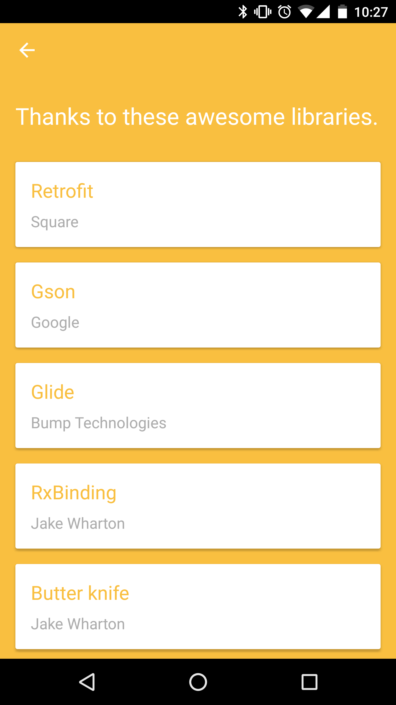
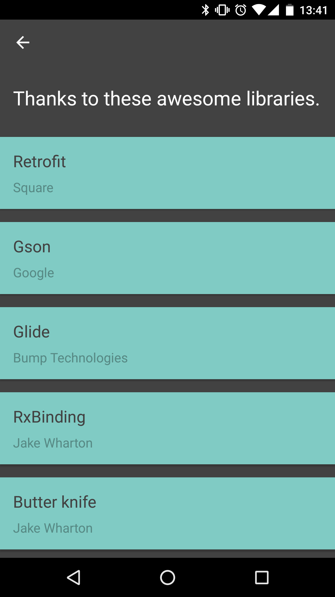

# MDLicense
MDLicense is a simple material design license UI component. If you are tired of the stereotyped open source licenses of your App, you can try this library.

## Screenshots



## Download
Gradle:

```groovy
repositories {
    jcenter()
}

dependencies {
    compile 'com.ge.droid:mdlicense:0.3.0'
}
```

## How do I use MDLicense?
#### Simple usage of the default theme
```java
new MDLicenseIntent.Builder(MainActivity.this)
    .libraries(getTestLibraries())
    .build()
    .launch();
```

#### Define custom style
```java
new MDLicenseIntent.Builder(MainActivity.this)
    .libraries(getTestLibraries())
    .headerText(getString(R.string.custom_header))
    .headerTextColor(ContextCompat.getColor(this, R.color.custom_header_text_color))
    .backgroundColor(ContextCompat.getColor(this, R.color.custom_background))
    .tileColor(ContextCompat.getColor(this, R.color.custom_tile_color))
    .libraryNameColor(ContextCompat.getColor(this, R.color.custom_library_name_color))
    .authorNameColor(ContextCompat.getColor(this, R.color.custom_author_name_color))
    .fullBleed(true)
    .build()
    .launch();
```

## Contributing  

- Please follow Android Studio's default code style.
- Feel free to send us pull requests to help improve this library.  

## License

    Copyright 2017 gejiaheng

    Licensed under the Apache License, Version 2.0 (the "License");
    you may not use this file except in compliance with the License.
    You may obtain a copy of the License at

       http://www.apache.org/licenses/LICENSE-2.0

    Unless required by applicable law or agreed to in writing, software
    distributed under the License is distributed on an "AS IS" BASIS,
    WITHOUT WARRANTIES OR CONDITIONS OF ANY KIND, either express or implied.
    See the License for the specific language governing permissions and
    limitations under the License.
